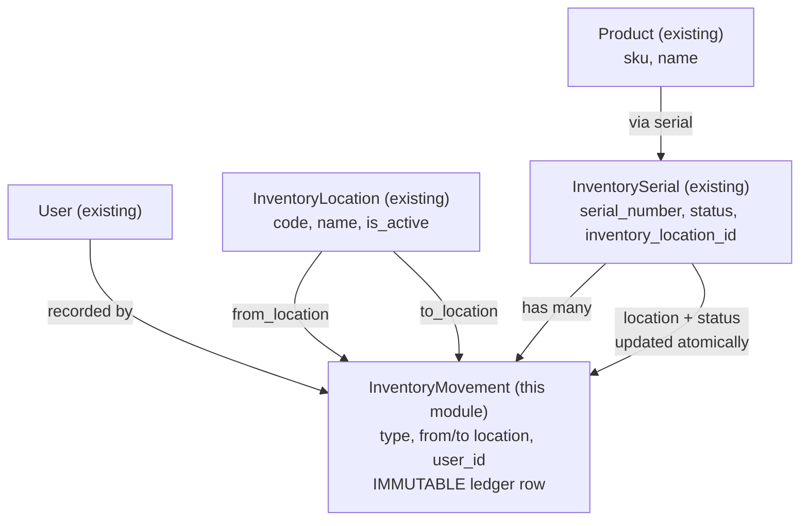

# InventoryMovement Module — Overview

## Prerequisites
- `inventory-location` module fully built and migrated
- `inventory-serial` module fully built and migrated
- InventorySerial model and SerialStatus enum must exist

---

## Business Context

`InventoryMovement` is the **immutable audit ledger** for every change to a serial number's
location or status. Every time a serial moves — received into stock, transferred between
shelves, sold to a customer, or adjusted for damage/loss — exactly one movement row is written.
This gives a complete lifecycle history for any serial number.

```
Serial: SN-00123 (Product: WIDGET-001)
  [receive]    NULL → Shelf L1   2024-01-10  (in_stock)
  [transfer]   L1   → L99        2024-03-05  (in_stock)
  [sale]       L99  → NULL       2024-05-14  (sold)
```

**Key business rule: movement rows are IMMUTABLE.**
Never updated, never deleted, no soft deletes.
A correction = a new `adjustment` row.

---

## Module Boundary

Admin-only. No customer-portal exposure.

| Concern | Handled by |
|---------|-----------|
| Record location/status change | `InventoryMovementService` |
| Paginated history list | `InventoryMovementController@index` |
| Per-serial timeline | `InventoryMovementService::historyForSerial()` |
| "Receive" movement (new stock) | Created by `InventorySerialService::receive()` — NOT this module's UI |

---

## Dependency Diagram



---

## Features (V1)

| # | Feature | Routes |
|---|---------|--------|
| 1 | Transfer serials — move serial from shelf A to shelf B | POST `/admin/inventory-movements` |
| 2 | Mark as sold — record sale movement with optional order reference | POST `/admin/inventory-movements` |
| 3 | Record adjustment — mark serial damaged or missing with reason | POST `/admin/inventory-movements` |
| 4 | Movement history — paginated log filterable by serial, location, type, date | GET `/admin/inventory-movements` |
| 5 | Serial timeline — all movements for one serial (used on serial show page) | GET `/admin/inventory-serials/{serial}/movements` |

> NOTE: `receive` movements are created automatically by InventorySerialService::receive()
> when a new serial is registered. There is NO UI form for receive movements in this module.
> The movement create form only shows: transfer, sale, adjustment.

---

## Role Access Matrix

| Permission | admin | manager | sales |
|------------|:-----:|:-------:|:-----:|
| View history | ✅ | ✅ | ✅ |
| View serial timeline | ✅ | ✅ | ✅ |
| Transfer | ✅ | ✅ | ✅ |
| Sale | ✅ | ✅ | ✅ |
| Adjustment | ✅ | ✅ | ❌ |

---

## File Map

| File | Path |
|------|------|
| Migration | `database/migrations/xxxx_create_inventory_movements_table.php` |
| Enum | `app/Enums/MovementType.php` |
| Model | `app/Models/InventoryMovement.php` |
| Factory | `database/factories/InventoryMovementFactory.php` |
| Service | `app/Services/InventoryMovementService.php` |
| Controller | `app/Http/Controllers/InventoryMovementController.php` |
| FormRequest | `app/Http/Requests/Inventory/StoreInventoryMovementRequest.php` |
| Policy | `app/Policies/InventoryMovementPolicy.php` |
| View: index | `resources/views/inventory/movements/index.blade.php` |
| View: create | `resources/views/inventory/movements/create.blade.php` |
| Permission Seeder | `database/seeders/InventoryMovementPermissionSeeder.php` |
| Feature Test | `tests/Feature/InventoryMovementControllerTest.php` |
| Unit Test | `tests/Unit/Services/InventoryMovementServiceTest.php` |

---

## Files to Modify

| File | Change |
|------|--------|
| `app/Enums/Permission.php` | Add `INVENTORY_MOVEMENTS_VIEW`, `INVENTORY_MOVEMENTS_TRANSFER`, `INVENTORY_MOVEMENTS_SELL`, `INVENTORY_MOVEMENTS_ADJUST` constants |
| `app/Models/InventorySerial.php` | Add `movements(): HasMany` relationship |
| `app/Providers/AppServiceProvider.php` | Register `InventoryMovementPolicy` |
| `routes/web.php` | Add movement routes inside admin group |
| `database/seeders/DatabaseSeeder.php` | Call `InventoryMovementPermissionSeeder` |

---

## Implementation Order

1. **Schema** — migration for `inventory_movements` table → `php artisan migrate`
2. **Enum** — `MovementType` (receive, transfer, sale, adjustment)
3. **Model** — `InventoryMovement` with relationships, scopes, no soft deletes
4. **Factory** — `InventoryMovementFactory`
5. **Service** — `InventoryMovementService` with `transfer()`, `sale()`, `adjustment()`, `historyForSerial()`, `listMovements()`
6. **FormRequest** — `StoreInventoryMovementRequest` with type-conditional validation
7. **Policy** — `InventoryMovementPolicy`
8. **Permission constants** — add to `Permission` enum
9. **Controller** — `InventoryMovementController` (index, create, store)
10. **Routes** — inside admin group
11. **Views** — index (history log), create (movement form)
12. **Seeders** — `InventoryMovementPermissionSeeder`
13. **Tests** — feature + unit

---

## Key Rules

- **Immutability** — no `update()`, `delete()`, or `SoftDeletes` on `InventoryMovement`
- **Atomic writes** — every service method wraps both the movement insert and the serial update in `DB::transaction()`
- **TOCTOU guard inside transaction** — status and location checks happen inside the transaction, not before
- **Validation** — cannot transfer/sell a serial with `status != in_stock`
- **Validation** — `from_location_id` must match serial's current `inventory_location_id` on transfer/sale
- **Eager loading** — always load `serial.product`, `fromLocation`, `toLocation`, `user` on movement queries
- **No lazy loading** — use `with()` everywhere
- **`strict_types=1`** on every PHP file
- **`$request->validated()`** always, never `$request->all()`
- **Roles** — `admin`, `manager`, `sales` (NOT `staff`, NOT `super_admin`)
